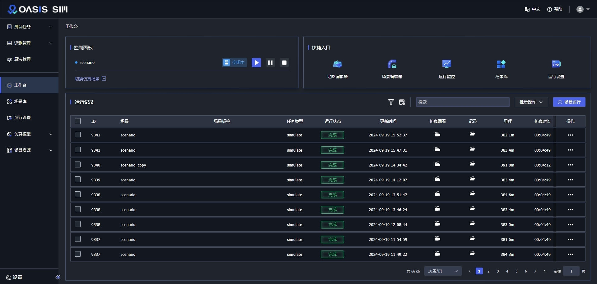
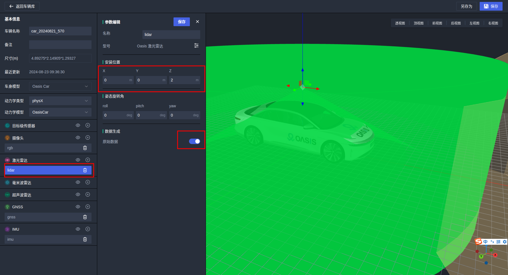
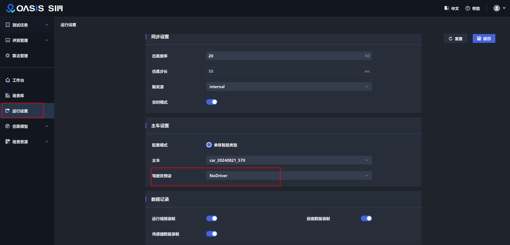

本分支仅用于 `Apollo` 和 `Oasis` 联合仿真文档说明，请按照文档步骤依次搭建环境并进行联合仿真。


<center><h4>OASIS SIM UI</h4></center>

# 1. 安装 Oasis

目前支持 Oasis V3.1.4； 如需要试用请联系商务 contact@synkrotron.ai 获取资源, 并备注本仓库地址：

```
https://github.com/guardstrikelab/carla_apollo_bridge.git
```

```shell
// 解压资源
tar -zxvf OasisSimV3.1.4-single.tar.gz

cd oasis

//安装 OASIS
./install.sh
```

安装成功后，申请 `license`，并运行内置基础场景，检查 `Oasis` 环境是否正常。


# 2. 安装 Apollo

机器硬件配置要求：

- 内存 32G
- 显卡 nvidia 3060、3080，显卡驱动 525

## 2.1 下载

下载地址：

- [https://github.com/ApolloAuto/apollo.git](https://github.com/ApolloAuto/apollo.git)
- [https://gitee.com/ApolloAuto/apollo.git](https://gitee.com/ApolloAuto/apollo.git)

上面两个地址我们选择国内的 `gitee` 速度会更快一些，执行下面命令，目前适配的是 `Apollo 8.0` 的版本。

```shell
git clone https://gitee.com/ApolloAuto/apollo.git

cd apollo

git checkout -b apollo_oasis  9537abebf3
```

> 注意: 切换到指定 commit ，该 commit 代码已经过调试验证可以正常开启 apollo 感知、规控等模块，其它 commit 代码未经验证。


## 2.2 编译

依次执行下面命令，将 `apollo` 的安装目录添加到环境变量中。

```shell

echo "export APOLLO_ROOT_DIR=$(pwd)" >> ~/.bashrc  && source ~/.bashrc
```

然后下载并启动 `apollo` 所需要的容器

```shell
bash docker/scripts/dev_start.sh
```

如果是在机器上第一次运行该命令则会等待较长时间，下载过程中如果由于网络连接报错重新执行该命令即可。

下载完成后，会有如下显示：

```shell
[ OK ] Congratulations! You have successfully finished setting up Apollo Dev Environment.
[ OK ] To login into the newly created apollo_dev_lei container, please run the following command:
[ OK ]   bash docker/scripts/dev_into.sh
[ OK ] Enjoy!
```

如果出现 “ERROR: Config value 'cuda' is not defined in any .rc file” ，请尝试用下面命令解决：

```shell
./apollo.sh config -n
```

执行下面命令，进入 `apollo` 容器，

```shell
bash docker/scripts/dev_into.sh
```

然后使用 `GPU` 编译

```shell
./apollo.sh build_gpu
```

同样，如果是第一次编译则需要等待较长时间，中途由于网络原因报错后，重新执行命令即可。

编译成功后会有下面打印，

```shell
==============================================
[ OK ] Done building apollo. Enjoy!
==============================================
```

# 3. 配置 Apollo

## 3.1 修改 lidar 静态坐标配置参数

进入 `apollo` 容器内执行下面命令，

```shell
cd /apollo/modules/drivers/lidar/velodyne/params/
cp velodyne128_novatel_extrinsics_example.yaml velodyne128_novatel_extrinsics.yaml

# 将重命名的文件拷贝到指定目录
cp velodyne128_novatel_extrinsics.yaml /apollo/modules/perception/data/params/
```

## 3.2 修改融合感知 camera 参数

```shell
cd /apollo/modules/perception/production/conf/perception/camera/
vi fusion_camera_detection_component.pb.txt
# 修改 enable_visualization 开关为 true
enable_visualization : true

vim trafficlights_perception_component.config
# 修改 tf2_timeout_second 为 0.1
tf2_timeout_second : 0.1
```

## 3.3 修改 lidar channel 名称

```shell
cd /apollo/modules/perception/production/dag
vim dag_streaming_perception.dag
# 将第 23 行的
channel: "/apollo/sensor/lidar128/compensator/PointCloud2"
# 修改为
channel: "/apollo/sensor/velodyne128/compensator/PointCloud2"


vim dag_streaming_perception_lidar.dag
将第 11 行的
channel: "/apollo/sensor/lidar128/compensator/PointCloud2"
# 修改为
channel: "/apollo/sensor/velodyne128/compensator/PointCloud2"
```

## 3.4 启动相关模块

在 `apollo` 容器内部，执行下面命令，启动图片解压缩模块

```shell
nohup mainboard -d /apollo/modules/drivers/tools/image_decompress/dag/image_decompress.dag &
```

开启定位模块

```shell
nohup mainboard -d /apollo/modules/localization/dag/dag_streaming_rtk_localization.dag &
```

# 4. 配置 Bridge

## 4.1 下载 apollo-bridge 源码

在 `apollo` 容器里面，进入 `/apollo/modules/` 目录，下载 `apollo-bridge` 代码。

```shell
cd apollo/modules
git clone -b oasis https://github.com/guardstrikelab/carla_apollo_bridge.git apollo-bridge
```

## 4.2 安装依赖

在 `apollo` 容器里面，进入 `apollo/modules/` 目录，执行命令。

```shell
cd /apollo/modules/apollo-bridge
./install.sh
```

安装完成后，在终端输入 `python` 命令，执行如下命令，查看 `oasis` 版本。
```shell
Python 3.6.9 (default, Jun 29 2022, 11:45:57)
[GCC 8.4.0] on linux
Type "help", "copyright", "credits" or "license" for more information.
>>> import oasis
>>> oasis.version
'v3.1.0'
>>>
```
有上面输出则说明安装成功。

## 4.3 修改配置

进入 `config` 目录下，修改 `settings.yaml` 中 `host` 为 `oasis` 机器的 `IP` 地址。

```yaml
  host: '192.168.1.201'
```

> 注意：测试主车需要搭载 IMU、GNSS、Lidar、Camera 等传感器


修改 `ego_sensors` 中 `IMU`、`GNSS`、`lidar`、`front_6mm_camera`等传感器的 `role_name`，
`role_name` 名称为主车名称 `ego_vehicle_` + 所搭载传感器名称。

如下所示，`lidar` 在车辆的安装位置可以参考下图：



```yaml
  ego_sensors:
    gnss:
      role_name: "ego_vehicle_gnss"
    imu:
      role_name: "ego_vehicle_imu"
    lidar:
      role_name: "ego_vehicle_lidar"
    front_6mm_camera:
      role_name: "ego_vehicle_rgb"
```

如果要测试 `apollo` 感知模块，则设置 `perception_switch` 为 `true`

```yaml
  perception_switch: true
```

否则设置 `perception_switch` 为 `false`。

## 4.4 启动 Dreamview

最后在 `apollo` 容器内部 `/apollo/` 目录下执行命令，启动 `Dreamview` 页面

```shell
./scripts/bootstrap.sh
```

启动成功后，在浏览器中打开

```shell
http://localhost:8888/
```

在 `Dreamview` 中开启下面几个模块：


在命令行查看 `mainboard` 进程如下图所示表明各个模块启动正常。


# 5. 启动联合仿真

1. 软件配置

在 `oasis` 仿真软件的运行设置界面将【驾驶员预设】选择为 `NoDriver` 表示不使用仿真软件内置的控制算法。




2. 运行脚本

在 `apollo` 容器内部，进入 `apollo/modules/apollo-bridge` 目录下，执行命令

```bash
source ~/.bashrc
python adapter.py
```

3. 下发任务

然后在 `oasis` 仿真软件的场景库选择场景，点击运行


如果一切正常，可以看到车辆能够正常运动起来，表示算法代码已正确接入。

注意： 运行 `adapter.py` 脚本一定要在场景运行之前执行，否则会无法收到场景运行的任务消息。


# 6. 常见问题

## 6.1 Drieamview 网页无法打开

执行 `./scripts/bootstrap.sh` 后提示

```shell
Failed to start Dreamview. Please check /apollo/data/log or /apollo/data/core for more information
```

该问题为官方 bug，详见

- [Failed to start Dreamview](https://github.com/ApolloAuto/apollo/issues/14730)
- [dreamview failed to start by ./scripts/bootstrap.sh](https://github.com/ApolloAuto/apollo/issues/12816)
- [Fail to run ./scripts/bootstrap.sh on Ubuntu 20.04](https://github.com/ApolloAuto/apollo/issues/12285)

issue 中提到的卸载 nvidia-docker 并不能解决该问题。

现有解决方法为删除 apollo 目录，重新下载代码编译。

> 调试经验： 不要远程访问 dreamview 可大概率避免该问题。


## 6.2 No module named 'carla'


解决方法：

```shell
source ~/.bashrc
```
